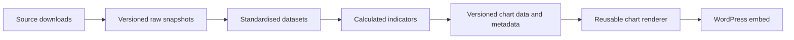

# Architecture

This document describes the existing pipeline and the proposed changes needed
for the headline life-expectancy graph. Proposed components are not yet
implemented. The implementation checklist lives in [plan.md](plan.md).

## Current system

The repository uses Python scripts for data processing and static HTML with
D3 and Observable Plot for presentation.

| Stage | Current implementation |
| --- | --- |
| Download | `scripts/download/owid/life_expectancy.py` fetches an OWID chart's CSV and metadata, using ETags and CSV hashes to skip unchanged data. |
| Manual ingest | `scripts/download/ingest_manual.py` imports CSV or ZIP exports and records dimensions, checksums, and provenance. |
| Snapshot | `data/snapshots/<source>/<dataset>/<date>/` holds source artifacts; `current.yaml` identifies the current version. |
| Standardise | `scripts/standardise/owid/life_expectancy.py` normalizes column names, checks duplicate entity/year rows, and writes CSV and selected metadata. |
| Chart | `scripts/charts/life_expectancy.py` creates HTML and a public CSV using a template and `charts/lib/longevityplot.js`. |
| Publish | Each pipeline script uploads its outputs through `scripts/utils/storage.py` to S3-compatible storage configured with `B2_*` variables. |

Raw data is gitignored; metadata and selected licence files are tracked. Source
CSVs are not restored automatically on a fresh clone. Standardised outputs and
generated charts currently overwrite their previous versions.

Scripts locate the repository through a required `.env` file. Build and upload
are coupled: there is no local-only build mode. Snapshot importers update local
state before upload, so a failed upload can leave a snapshot that reruns skip.

## Proposed flow

Keep this in one repository initially. Static artifacts and object storage are
sufficient for the first chart; a database or live data API is not required.

### Ingestion and snapshots

Source adapters handle retrieval and source-specific formats. Preserve source
artifacts with checksums, source URLs, release identifiers, retrieval dates,
citations, and licence information. A snapshot must be usable without fetching
the latest upstream data again. Detect metadata changes as well as CSV changes.

Separate repository path discovery from credentials. Configuration belongs in
the environment, with `.env` as a local convenience. Separate download, build,
and publish operations so calculations can run locally without cloud access.

### Standardisation

Normalize source data into explicit dimensions rather than encoding sex, age,
or units in chart-specific column names. A proposed observation contains:

- Stable location ID, year, sex, and age.
- Measure, value, and unit.
- Source release and historical-estimate/projection status.

Maintain location names, country/territory eligibility, population, and income
classifications as reference datasets. Record classification vintages and join
rules. Validate uniqueness using all relevant dimensions, not just entity/year.
Do not silently combine measures with different definitions.

### Calculated indicators

Add a calculation layer between standardisation and presentation. It owns
frontier selection, group summaries, medians, and later improvement rates and
distance-to-frontier measures. Keep those calculations out of browser code.

Each output records its input snapshots, methodology, and calculation code
version. Preserve missing observations as gaps; do not silently interpolate or
mix historical estimates with projections.

### Chart artifacts and rendering

Produce small chart-ready datasets and a manifest describing units, series,
defaults, coverage, sources, and methodology. Use stable chart IDs independently
of source dataset names. The renderer handles layout, controls, tooltips, and
accessibility; it consumes already calculated indicators.

Retain Observable Plot and the static HTML embed approach for the first graph.
Generalize the current renderer as needed for background country lines and
highlighted summary series. Reuse the component for sex and age views.

### Publication

Publish immutable releases containing data, metadata, and compatible rendering
assets. Upload and validate the complete release before updating a public
manifest that points to it. Make failed uploads resumable and preserve earlier
releases for rollback. Record dependency versions and the code revision needed
to reproduce a build.

### Website embedding

Embed the hosted chart in WordPress. Verify responsive sizing, chart controls,
and download links within the page.

## Headline graph scope and pending definitions

The initial view is life expectancy at birth, female by default with a male
toggle. Show all eligible countries in grey and highlight best practice,
high-income countries, global median, and low-income countries. Add the age-65
view using the same model after validating the at-birth chart.

The proposal's written series differ from its mockup, which shows a world
average and bottom quartile. Use the written series as the provisional scope;
confirm the following before implementing calculations:

| Decision | Proposed starting point |
| --- | --- |
| Best practice | Maximum life expectancy among eligible countries with total population strictly above one million in that year. Retain winning location IDs and define tie handling. |
| Country universe | Explicitly define country and territory eligibility; exclude regional aggregates from country calculations. |
| Global median | Unweighted median of eligible country life expectancies, labelled as a country median rather than median individual lifespan. |
| Income-group series | Prefer source-provided group life expectancy if definitions fit. A weighted average of national life expectancies is a different statistic. |
| Income membership | Record classification vintage and decide whether membership is fixed or changes over time. |
| Age 65 | Remaining life expectancy in years, not expected age at death. |
| Coverage | Start with a consistent historical source and document missing coverage. Keep projections separate. |

Audit UN World Population Prospects directly and through OWID before choosing
the data adapter. Confirm sex, age, population, group definitions, units, and
historical coverage in actual downloaded artifacts. Do not assume the current
OWID chart supplies all required dimensions.

## Broader roadmap constraints

The same layers can support country dashboards and improvement charts. Lifespan
percentiles require mortality distributions or life tables; they cannot be
derived from life expectancy alone. Healthy-life-expectancy measures must retain
their methodological distinctions. The existing IHME `all_cause_deaths`
metadata describes YLDs and has inconsistent release/citation information;
verify its underlying export before using it in a published indicator.

## References

- [UN World Population Prospects](https://population.un.org/wpp/)
- [OWID WPP life expectancy chart and definitions](https://ourworldindata.org/grapher/life-expectancy-unwpp)
